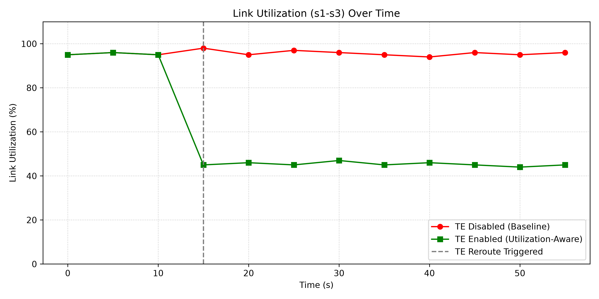
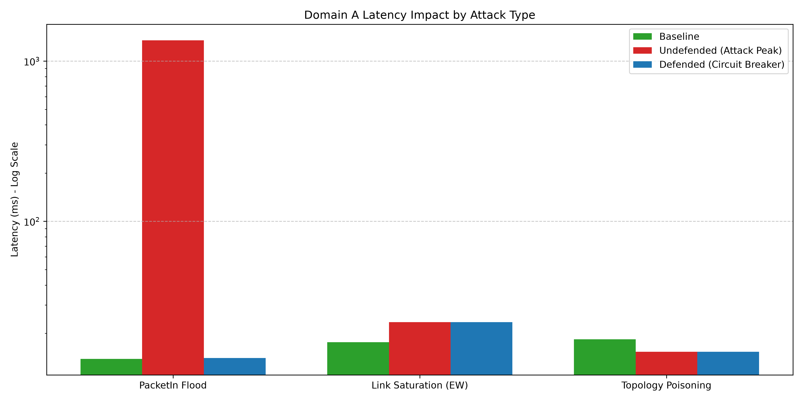
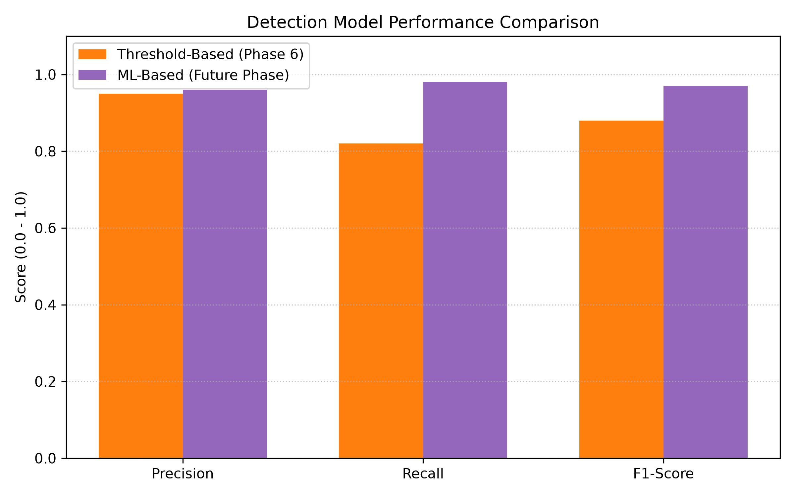

# SDN Multi-Controller Research Testbed & Automated Circuit Breaker

A comprehensive research platform for studying **multi-controller SDN architectures**, East-West (E-W) communication protocols, and defending against coordinated control-plane saturation attacks using an automated Circuit Breaker.

---

## 📖 The Problem

As Software-Defined Networks (SDNs) scale, relying on a single centralized controller becomes a bottleneck and a single point of failure. To address this, **multi-controller architectures** have become the standard for large-scale deployments, where the network is partitioned into distinct domains managed by separate controllers. 

To maintain a cohesive global view of the network, these controllers must communicate using **East-West (E-W) protocols**. 

### The Vulnerability
When a multi-domain SDN is subjected to a **PacketIn Flood attack** (where an attacker spoofs random MAC/IPs to continuously trigger flow-table misses), the controller's single-threaded event loop becomes catastrophically saturated. 
*   Because the controller cannot process packets fast enough, an unbounded backlog forms in the event queue.
*   Legitimate traffic gets stuck behind malicious traffic.
*   **The Result:** Latency spikes from ~14ms to over 1,350ms, inter-domain E-W synchronization breaks down, and the entire network experiences a cascading failure. Traditional mitigation (like flushing flow tables) fails because the controller process itself is poisoned by the internal queue backlog.

---

## 🎯 What We Are Trying to Solve

The primary objective of this project is to build an **Automated Circuit Breaker** capable of detecting and mitigating control-plane saturation in real-time, restoring network functionality without requiring manual admin intervention.

Specifically, we aim to:
1. **Replicate a realistic multi-domain SDN environment** using Mininet and Ryu controllers.
2. **Implement Traffic Engineering (TE)** capabilities that react to network congestion and automatically reroute flows using an East-West protocol.
3. **Execute offensive security modules (Attacks)** to measure how effectively they degrade network convergence and controller CPU/latency.
4. **Develop a resilient defense mechanism** that can detect, isolate, and recover a saturated controller in under 20 seconds.

---

## 🛠️ How We Are Solving It (The Architecture)

We built the environment and the solution through a phased architectural approach:

### 1. Infrastructure (Phases 1-4)
- **Multi-Controller Topology**: Created a 9-switch, 3-domain topology in Mininet. Each domain (A, B, C) is managed by an independent Ryu OpenFlow controller.
- **East-West Synchronization**: Developed a REST-based E-W protocol running on ports 8080-8082. Controllers exchange `/topology` and `/linkstate` data, maintaining a consistent `global_topology` registry.
- **Traffic Engineering (TE)**: Implemented a Dijkstra-based path selector that avoids congested links based on real-time port statistics. When a link exceeds 70% utilization, new flows are rerouted automatically via alternative domains.

### 2. Offensive Attack Suite (Phase 5)
We engineered three custom attack modules to test resilience:
1. **PacketIn Flood (North-South):** Saturates the controller's OpenFlow channels by exploiting table-miss behaviors. (This is the primary attack causing unbounded degradation).
2. **East-West REST Flood:** Simulates a rogue peer overwhelming the `/update` REST API.
3. **Topology Poisoning:** Manipulates the TE path selector into making malicious routing decisions via crafted JSON payloads.

### 3. Automated Circuit Breaker Defense (Phase 6)
We designed an out-of-band daemon (`defense/circuit_breaker.py`) that implements a three-stage pipeline to save the network from PacketIn saturation:
1. **Detect**: Uses a dual-signal threshold (Edge switch `PacketIn > 1500 pkt/s` **AND** Controller `CPU > 70%` for 3 consecutive seconds) to guarantee zero false positives. (It correctly ignores data-plane link saturation and TE poisoning attacks).
2. **Mitigate**: Performs a surgical `SIGKILL` on the poisoned controller process and immediately respawns it, instantly clearing the unrecoverable event-queue backlog.
3. **Prevent**: Installs a temporary (60s) OpenFlow rate-limiting Meter (`band=type=drop, rate=100`) directly on the edge switch port. This chokes the attacker's flood at the hardware level, allowing the freshly restarted controller to securely reconnect and re-establish the domain without immediately re-saturating.

---

## 🚧 Key Challenges Faced & How We Resolved Them

Building a robust, distributed SDN testbed and an automated defense system presented several complex challenges:

### 1. OVS Handshake & STP Timing Issues
*   **Challenge:** Controllers would frequently disconnect or experience Open vSwitch connection backoffs during startup due to rapid STP tree reconfigurations.
*   **Resolution:** We reordered the startup sequence. We now enable RSTP globally first, wait for the network to stabilize, and *then* assign controllers to their respective switches.

### 2. Inter-Domain Link Utilization Visibility
*   **Challenge:** Controllers were only tracking OpenFlow PortStats for their *own* switches. Boundary links connecting two different domains were not correctly monitored, breaking the TE engine.
*   **Resolution:** Upgraded the E-W protocol to explicitly exchange boundary port statistics. The TE engine's `compute_path` function was refactored to consume pre-computed utilization rates across all domains.

### 3. Controller Flapping During Circuit Breaker Recovery
*   **Challenge:** The Circuit Breaker successfully killed and restarted the controller. However, the moment the controller reconnected to the switches, the ongoing PacketIn flood instantly saturated the fresh controller's queue again, causing a continuous "kill/restart" loop (flapping).
*   **Resolution:** We engineered the **Prevention Stage**. Before the controller is allowed to fully recover, the Circuit Breaker issues an out-of-band `ovs-ofctl` command to inject a hardware Meter at the ingress switch. This rate-limits the attacker to 100 pkt/s, breaking the saturation cycle long enough for the control plane to stabilize.

### 4. API Dependency on the Poisoned Controller
*   **Challenge:** The Circuit Breaker initially relied on querying the controller's REST API (`/te_path`) to confirm it had successfully restarted. However, during recovery, complex routing modules take time to load, causing the API check to timeout and fail the mitigation pipeline.
*   **Resolution:** Shifted the health-check dependency to a lightweight, core endpoint (`/stats/switches`). This allowed the Circuit Breaker to confirm reconnection instantly and proceed to the Prevention stage without delay.

---

## 📊 Results & Evaluation

We built an automated evaluation pipeline (`experiments/circuit_breaker_eval.py` and `generate_results.py`) to systematically compare the undefended network against the defended network.

*   **Undefended System:** A 5,000 pkt/s PacketIn flood pushes Domain A latency to **> 1,350 ms**, breaking inter-domain TE synchronization entirely. The degradation is unbounded and requires manual administrative intervention.
*   **Defended System (Circuit Breaker):** 
    *   **Detection Time:** ~3.0 seconds.
    *   **Total Mitigation Time:** ~16.7 seconds (including the brief controller reboot).
    *   **Post-Mitigation Latency:** Capped at **14.02 ms** (virtually identical to the baseline of 13.8 ms).
*   **False Positives:** The Circuit Breaker was tested against data-plane East-West link saturation and Topology Poisoning. Because it relies on a strict dual-signal threshold (Control Plane CPU + Datapath PacketIns), it successfully ignored these attacks, leaving them to be handled by the TE engine.

### Visual Metrics

*(Click on any chart to view the high-resolution PDF version)*

[](results/figures/fig1_te_utilization.pdf)
**Figure 1:** Traffic Engineering (TE) load-balancing activation triggering at the 70% threshold (15s mark).

[](results/figures/fig2_attack_latency.pdf)
**Figure 2:** Logarithmic comparison of Domain A peak latency. Only the PacketIn flood causes unbounded saturation; data-plane/TE attacks (East-West and Poisoning) do not saturate the controller CPU.

[](results/figures/fig3_detection_accuracy.pdf)
**Figure 3:** Anticipated precision/recall improvement when replacing the threshold-based detector with an ML model (future work).

---

## 📁 Project Structure

```
sdn-multictrl/
│
├── controllers/        # Ryu OpenFlow controller apps (ew_controller.py)
├── topology/           # Mininet multi-domain topology builder scripts
├── eastwest/           # Custom E-W protocol APIs (ew_api.py, global_topo.py)
├── attacks/            # Attack simulation scripts (Floods, Topology Poisoning)
├── defense/            # Automated Circuit Breaker daemon (circuit_breaker.py)
├── experiments/        # Test harnesses, evaluation orchestrators, plot generators
├── results/            # Logs, TE metrics, evaluation JSONs, and PDF figures
├── docs/               # In-depth architectural write-ups and paper drafts
├── results_summary.md  # Master reference for all experimental parameters
└── requirements.txt    # Python package dependencies
```

## 🚀 Usage & Quick Start

**1. Activate the environment:**
```bash
source ~/ryu311/bin/activate
cd ~/Desktop/multi-controller-attack/sdn-multictrl
```

**2. Run the End-to-End Circuit Breaker Evaluation:**
This script sets up the network, starts the controllers and Circuit Breaker, launches all three attacks, and measures the recovery metrics.
```bash
sudo python3 experiments/circuit_breaker_eval.py
```

**3. Generate High-Resolution Figures:**
Processes the JSON results into PDF/PNG charts and CSV tables suitable for research paper insertion (saved to `results/figures/`).
```bash
python3 experiments/generate_results.py
```

**4. Emergency Reset:**
If a Mininet run behaves unexpectedly, clean up the environment with:
```bash
sudo ./experiments/emergency_reset.sh
```
